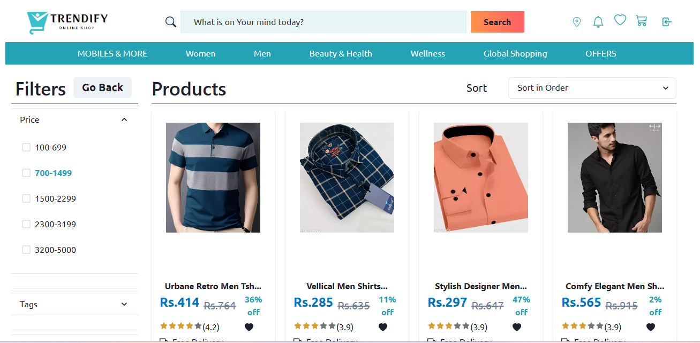
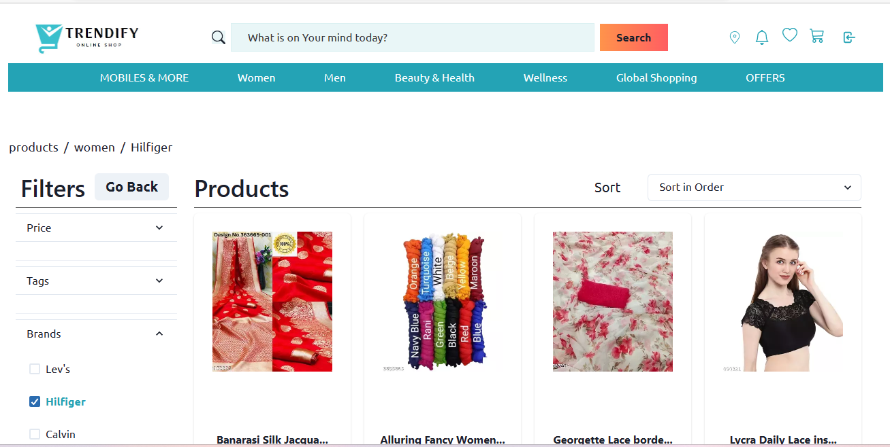
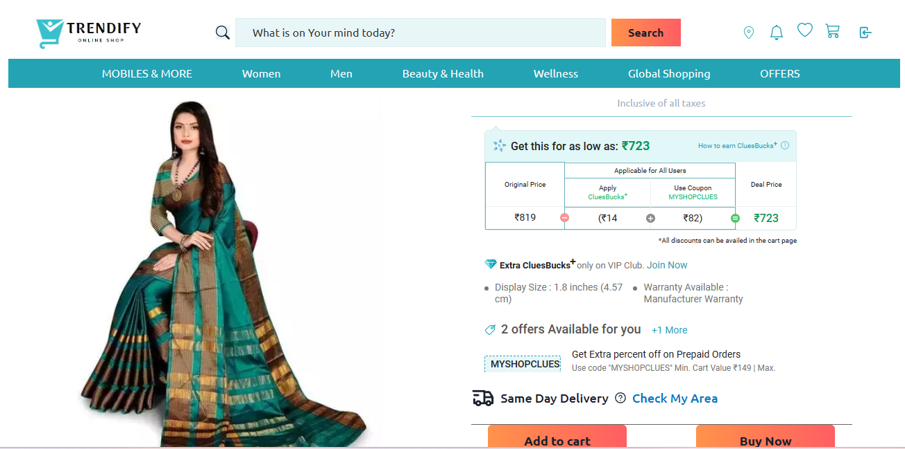

### Project-Code: eminent-art-8078

<h1><a href="https://trendify-omega.vercel.app/" >TRENDIFY</a></h1>
<!-- <a href="https://erin-dizzy-clam.cyclic.app/" >Backened Deployed Link</a> -->

<!-- # TRENDIFY -->

<h3 > RESPONSIVE  |  DYNAMIC | COLLABORATIVE </h3>

 

- Trendify is Ecommerce website inspired by Shopclues.com. It is a Lifestyle Accessories Brand that curates stunning designs and prints it on a wide range of personal accessories. 

<h3 >Frontend</h3> 

<!-- 
   
 -->

<h3 >Backend</h3> 

 

<!-- An e-commerce website for clothing, health & care products. A Collaborative project Built in 5 Days. -->

## Members:

- Team Lead : <strong> Disha Gupta </strong>
  (Product page, Responsiveness, Single Product Page,Backend )

<ul>
<li> Team Member: Lokesh Chaudhary ( HomePage, Responsiveness, Login Page) </li>
 
<li> Team Member: Rahul Dudka ( Cart Page, Admin Page, CRUD Functionality) </li>
 
<li> Team Member: Sourabh Patel ( Payment Page,Wishlist Page Including CRUD Functionality, Search Funtionality, Footer, Checkout Section, Navbar ) </li>
 

</ul>

## Snippets of Our Website-

 

## Home Page-

 

## Product Page-

### Men's-

 

### Women's-

 

## Single Product Page-

 
   
## Cart Page-

<!--  -->

    

## Admin Page\*

## Admin Products Page\*

